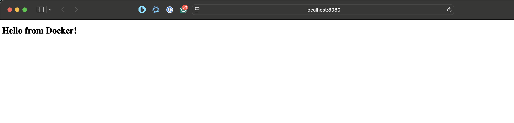
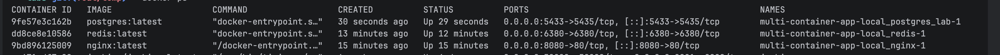
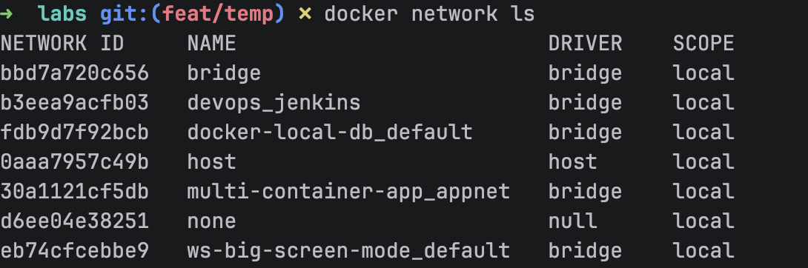
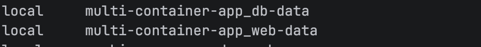
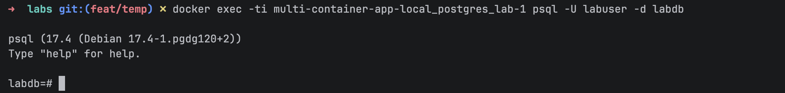
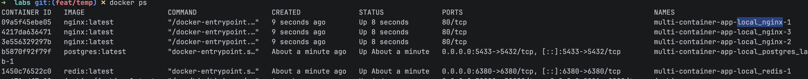
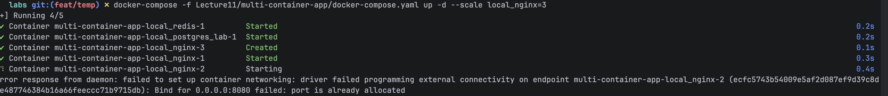

##  Docker compose
1. Run docker-compose -f Lecture11/multi-container-app/docker-compose.yaml up -d
2. Container status 
3. Check app networks 
4. Check app volumes 
5. Access to db container
6. Scale local_nginx container
7. For scale nginx I need to comment port mapping in docker-compose.yaml file because of port conflict