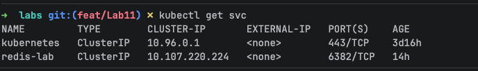
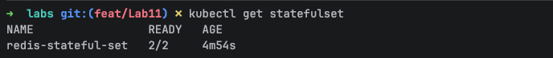
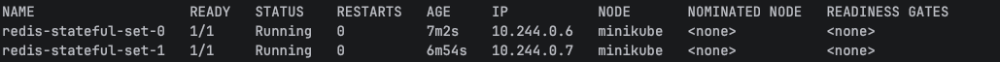
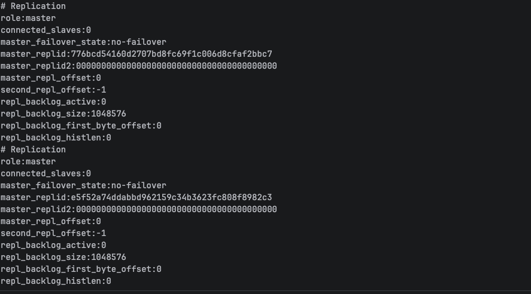
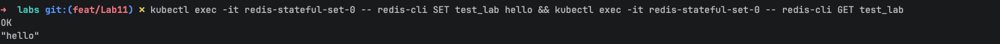
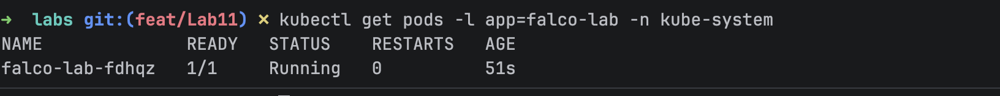
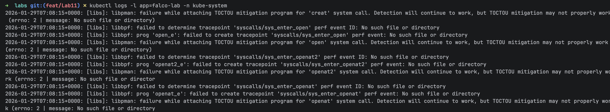

##  StatefulSet for Redis cluster
1. Create Redis cluster
2. Create StatefulSet for Redis
3. Apply manifests kubectl apply -f Lecture13/redis-service-manifest.yaml -f Lecture13/redis-stateful-set-manifest.yaml
4. Verify Redis Service 
5. Verify Redis StatefulSet 
6. Verify redis pods 
7. Verify replicas info kubectl exec -it redis-stateful-set-0 -- redis-cli INFO replication && kubectl exec -it redis-stateful-set-1 -- redis-cli INFO replication 
8. Verify set key value in redis kubectl exec -it redis-stateful-set-0 -- redis-cli SET test_lab hello && kubectl exec -it redis-stateful-set-0 -- redis-cli GET test_lab 

##  Falco DaemonSet for log collection
1. Create Falco DaemonSet yaml for log collection
2. Apply manifests kubectl apply -f Lecture13/falco-daemonset.yaml
3. Verify Falco DaemonSet 
4. Verify Falco pods 
5. Verify falco logs kubectl logs -l app=falco-lab -n kube-system 