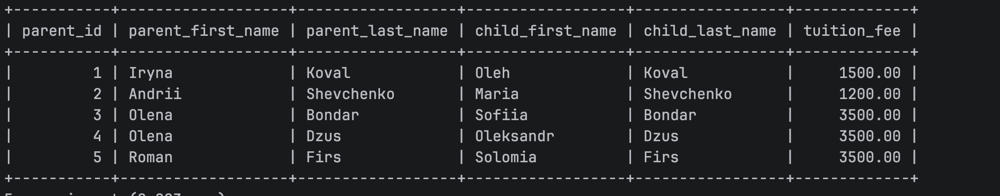
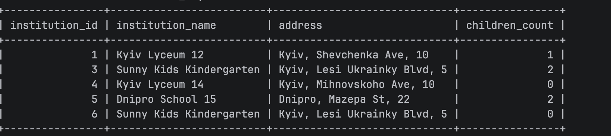
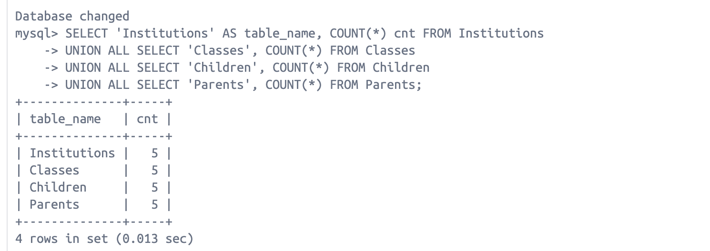

## SQL
1. Create docker-compose with mysql
2. Create a database named "school_kindergarden"
3. Create a tables described in schema.sql
4. Children with class and institution 
5. ParentChild fees
6. Institution with address and child count 
7. DB backup docker exec local_mysql_lab mysqldump -umy_user -pmy_password school_db_restore > schooldb_backup.sql
8. DB restore schooldb_restore 