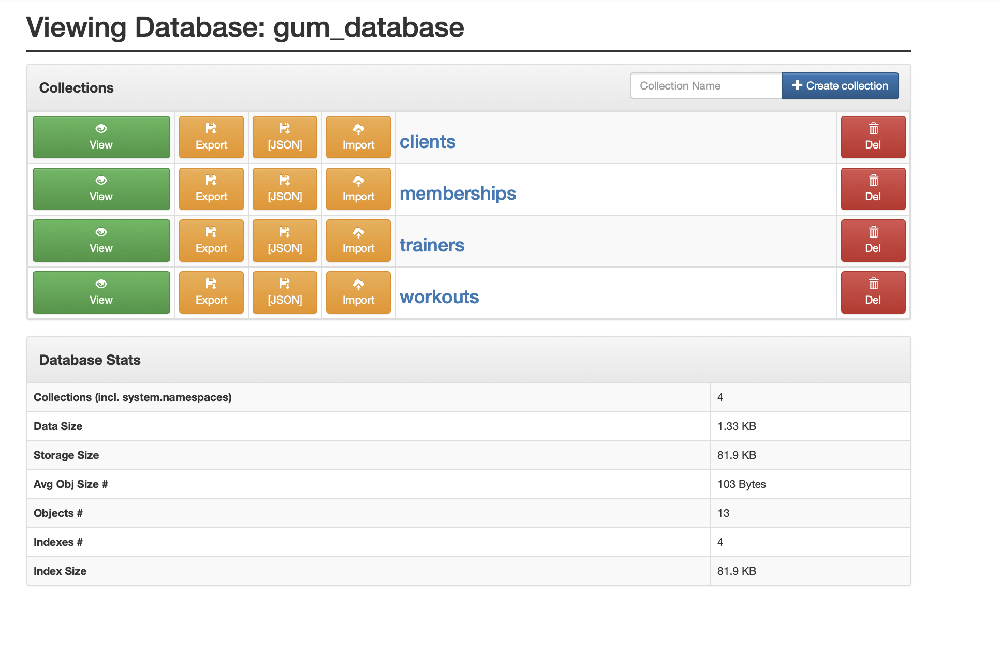
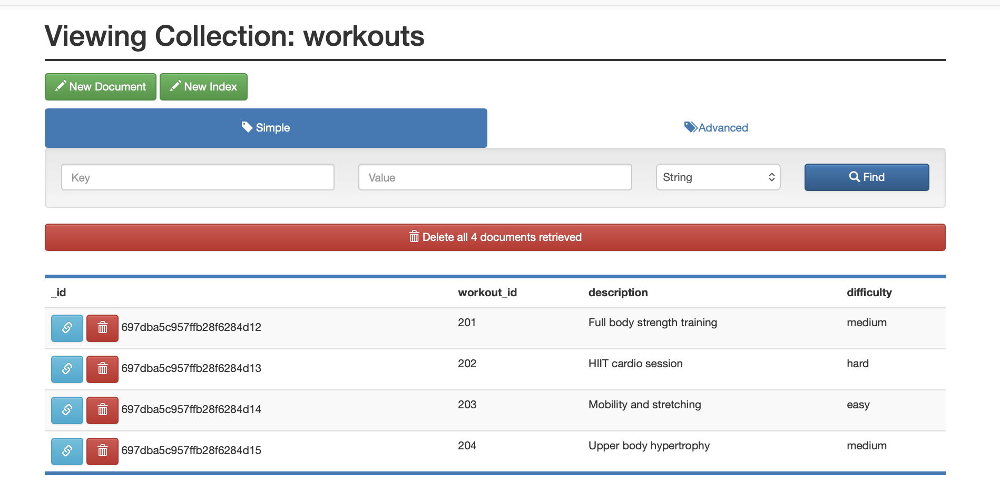
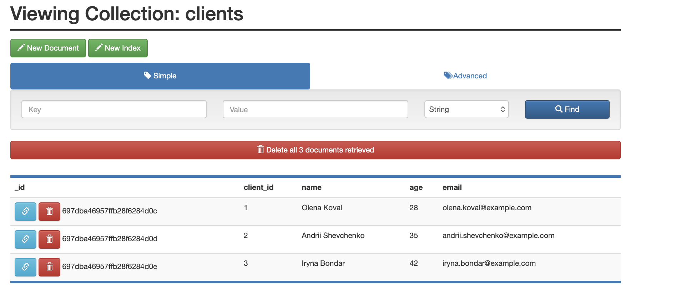
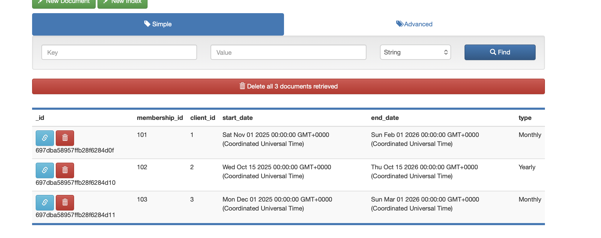
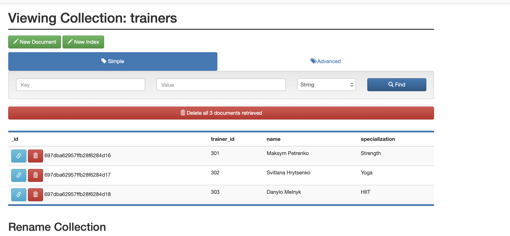
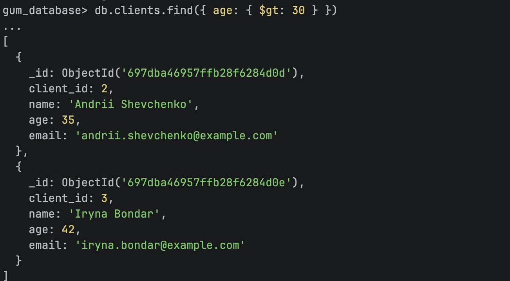
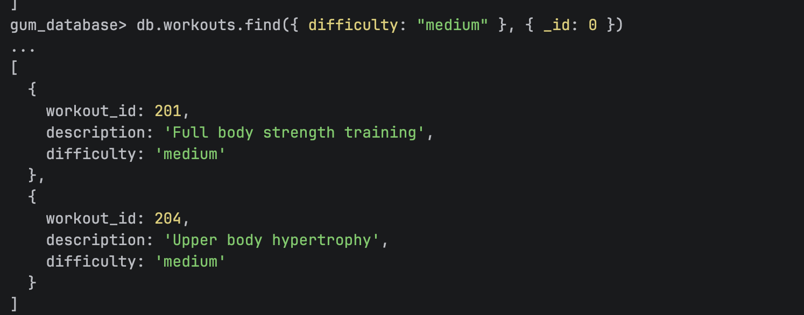
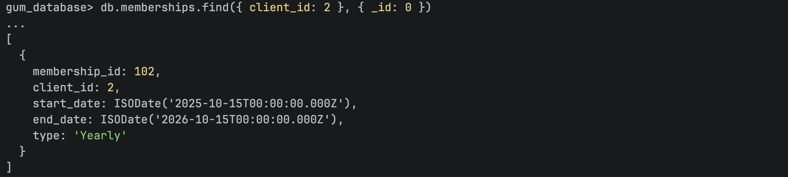

## MongoDB
1. Create docker-compose with mongo and mongo-express services
2. Create collections gym collections 
3. Insert documents into collections 

4. Members older 30  
5. Workouts with medium level 
6. Clients by id 