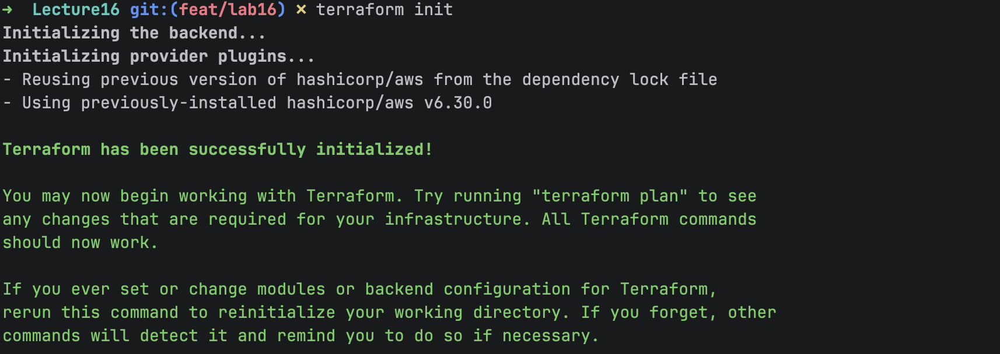
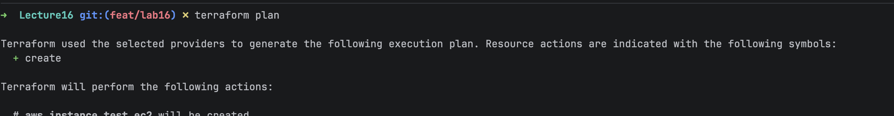
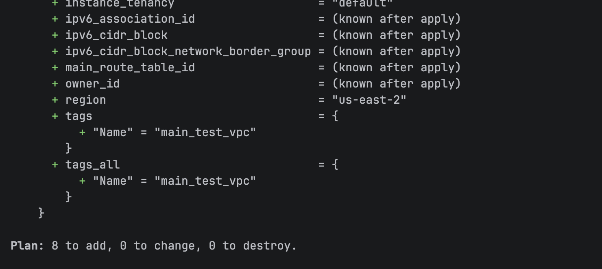
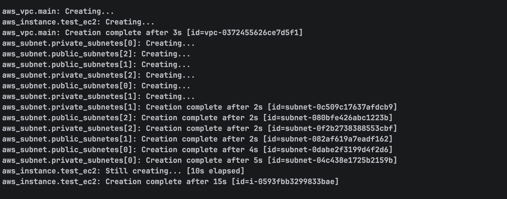
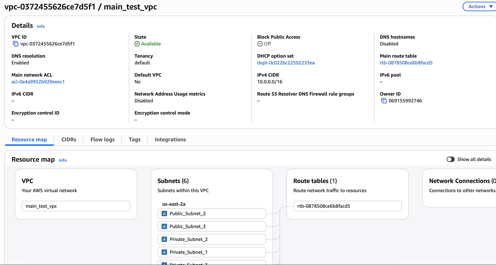
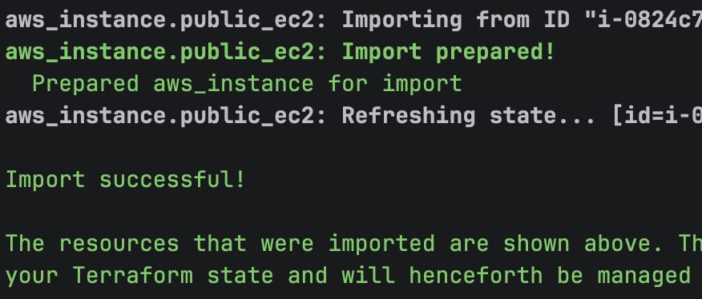

## Terraform 
1. Create main.tf file with vpc, subnet, and ec2 instance resources.
2. terraform init
3. Terraform plan 
4. terraform apply 
5. Verify es2 in AWS Console 
6. Verify vpc and subnet in AWS Console 
7. Create sub dir for terrafrom import and create import.tf with  ec2 instance resources.
8. Run terrafrom import command to import existing ec2 instance into terraform state. 
9. 