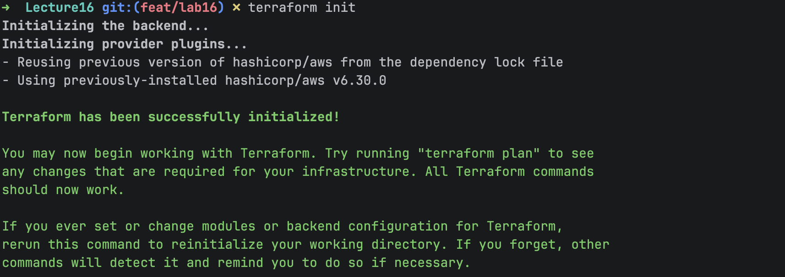
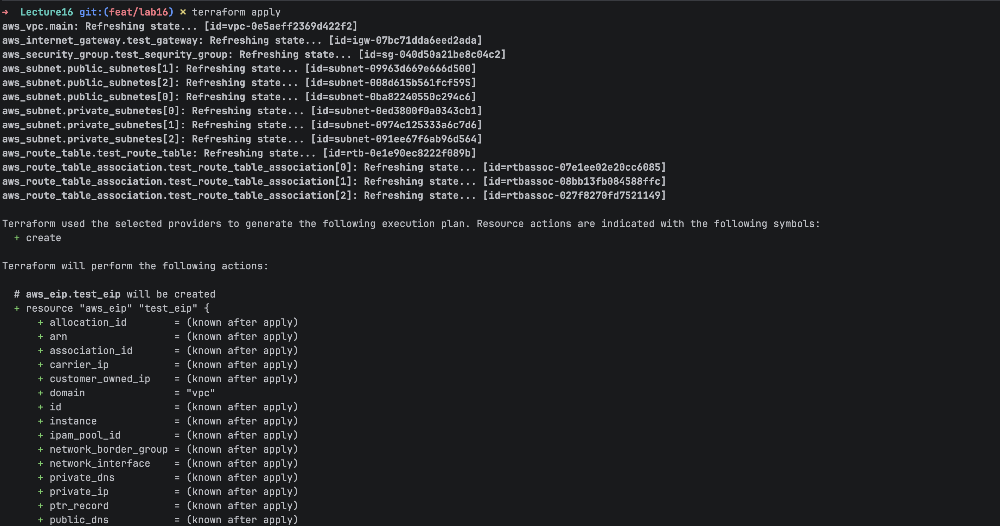
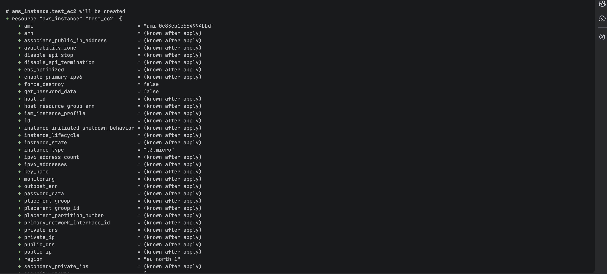
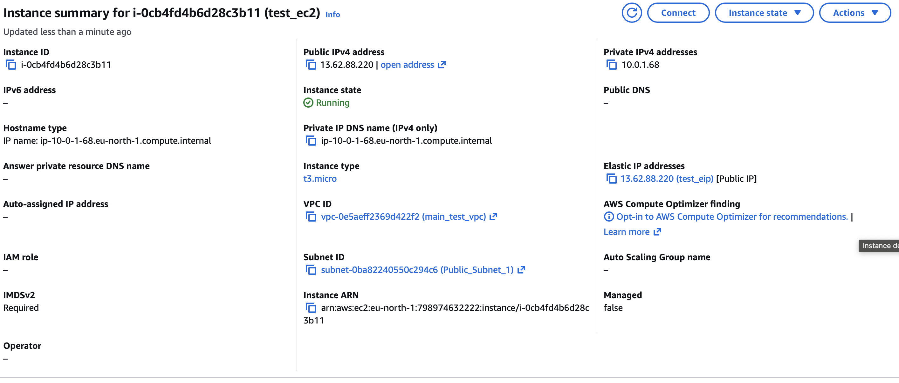
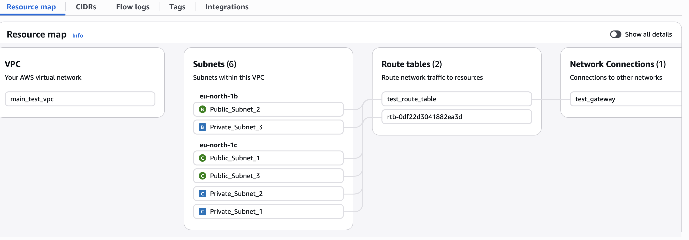
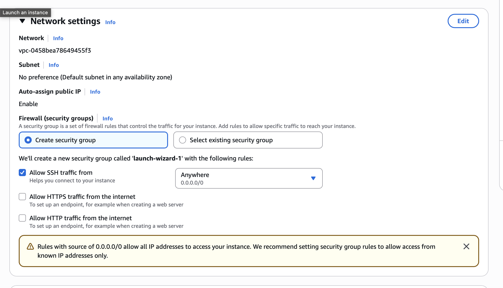

## Terraform
1. Create main.tf file with vpc, subnet, and ec2 instance resources.
2. terraform init
3. Terraform plan 
4. terraform apply 
5. Verify es2 in AWS Console 
6. Verify vpc, subnet, gateway, route_tables in AWS Console 
7. Verify ec2 network settings in AWS Console 

