## Terraform
1. Create eks  cluster with with yaml 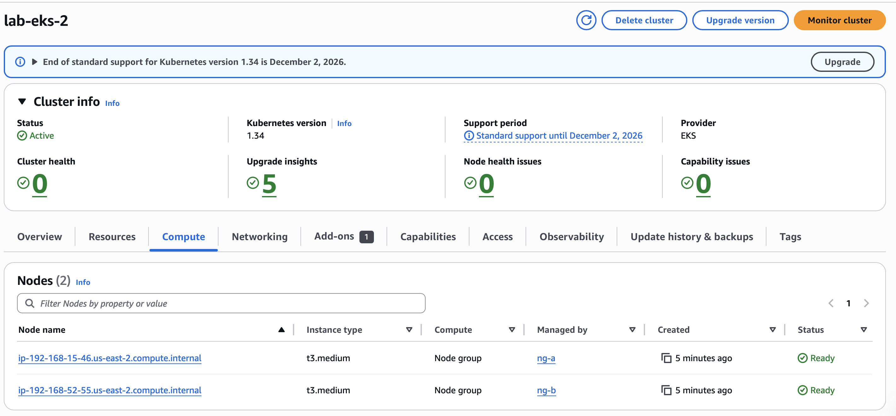
2. Verify nodes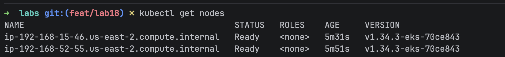
2. Create kubernetes manifest
3. Apply manifest with kubectl 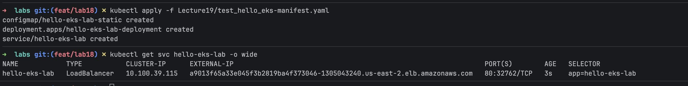
4. Verify app is running 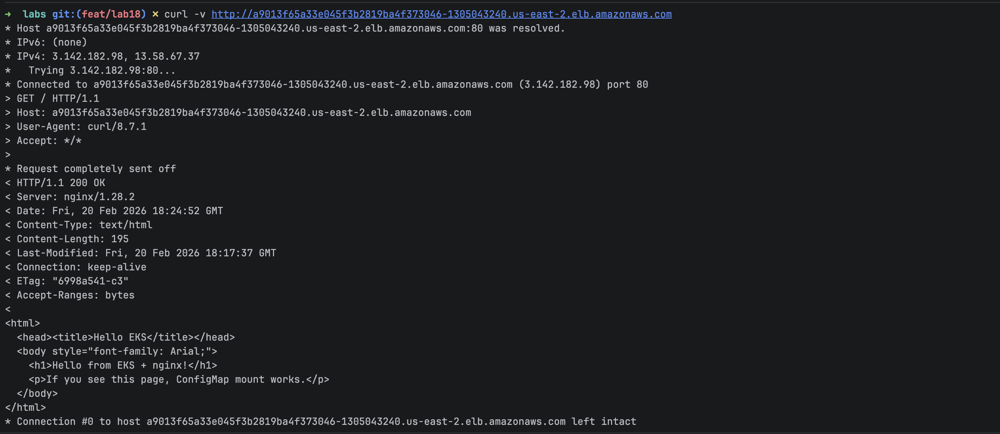
5. Add ebs addon to cluster with eksctl 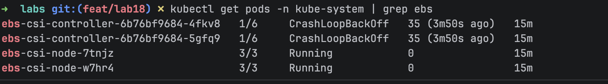
6. Apply pvc-ebs manifest with kubectl 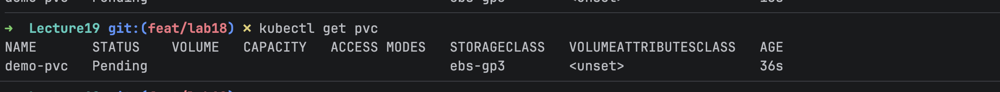
7. Add iam role for ebs addon with eksctl 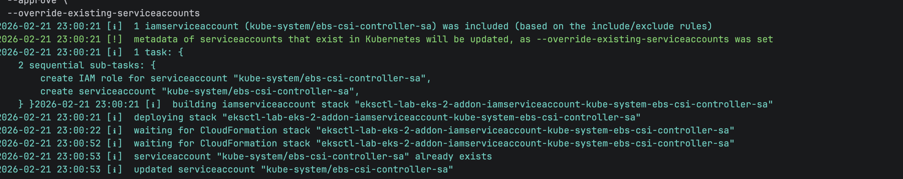
8. Verify pvs 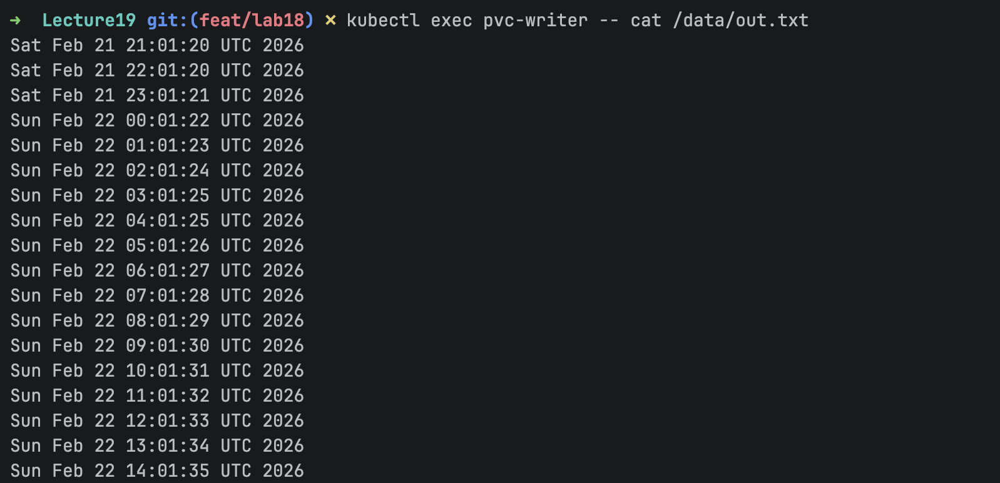
9. Create job with echo "Hello from EKS" 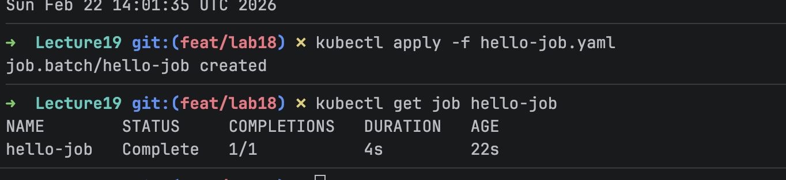
10. Create dev name space 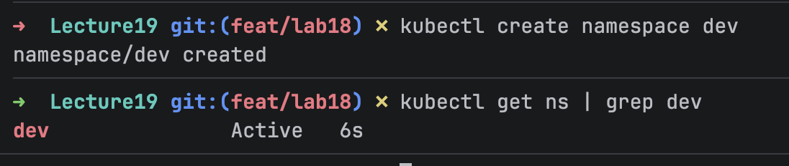
11. Create busybox deployment in dev namespace 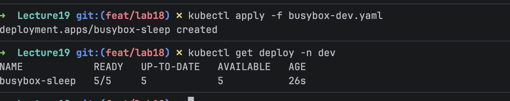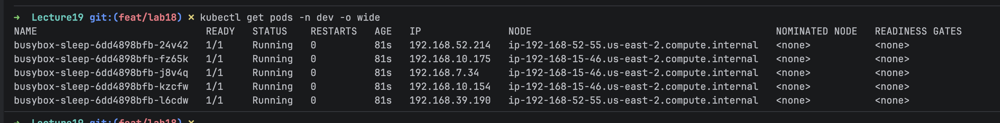
12. Verify eks resources in AWS Console 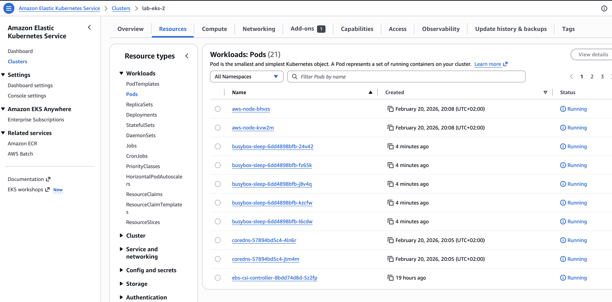