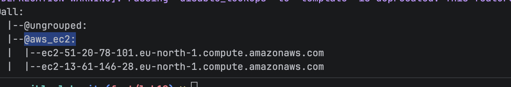
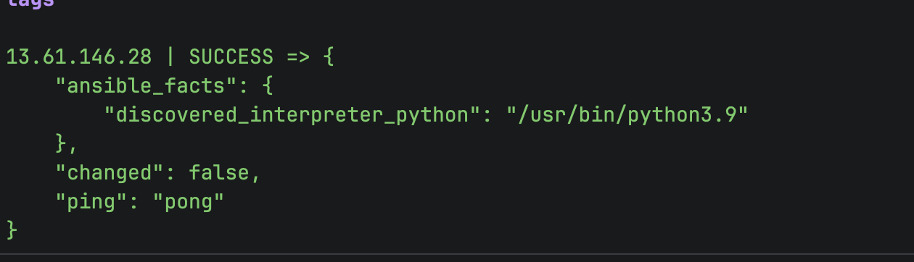
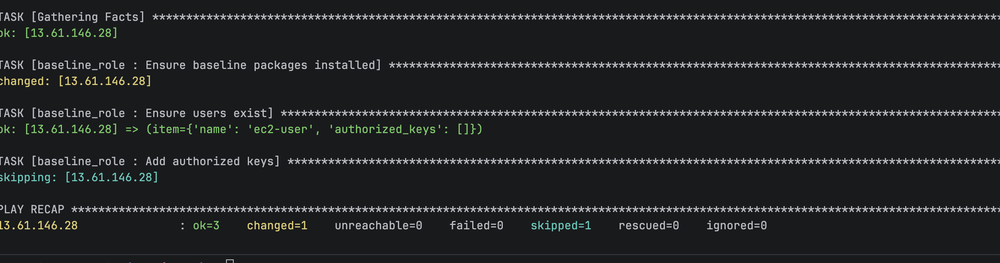
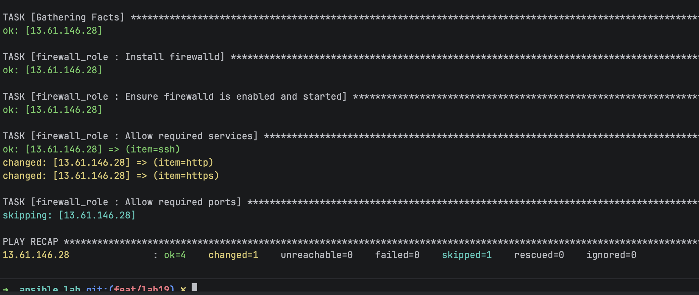
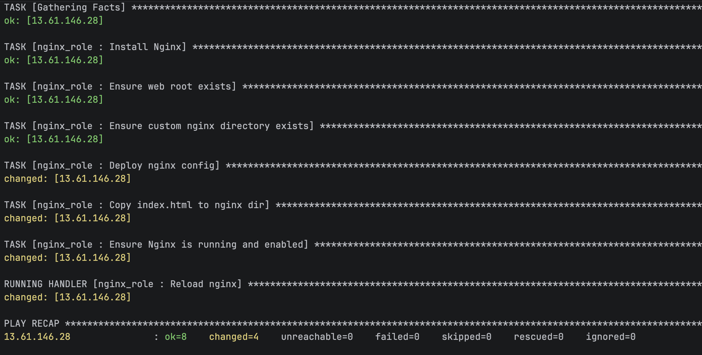
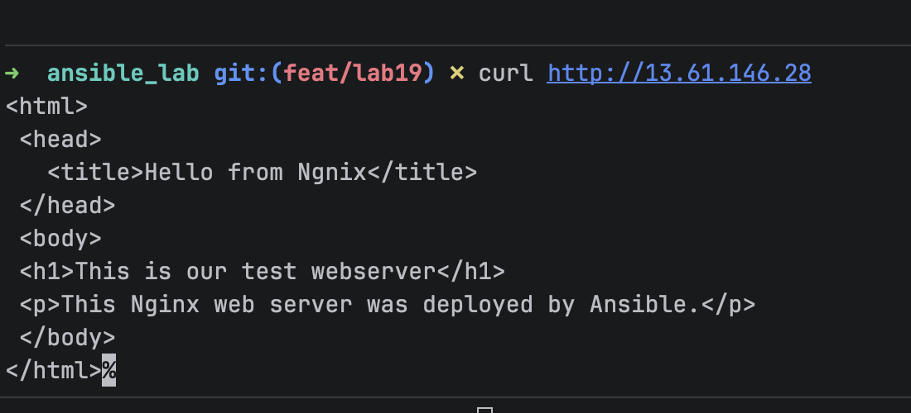
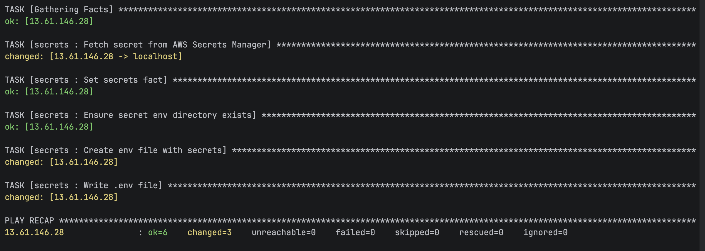
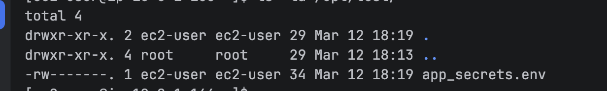
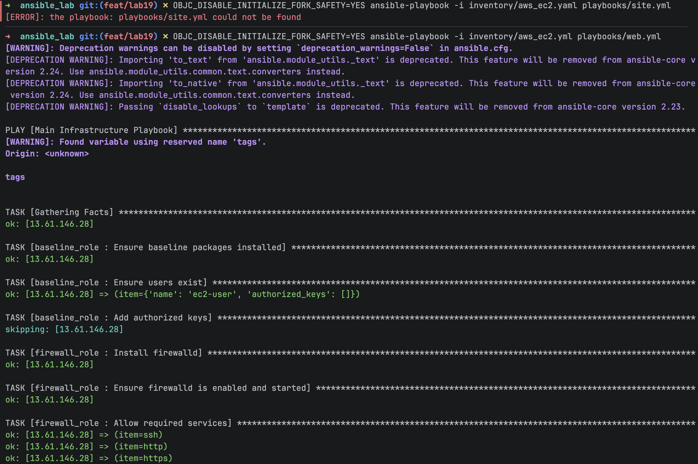
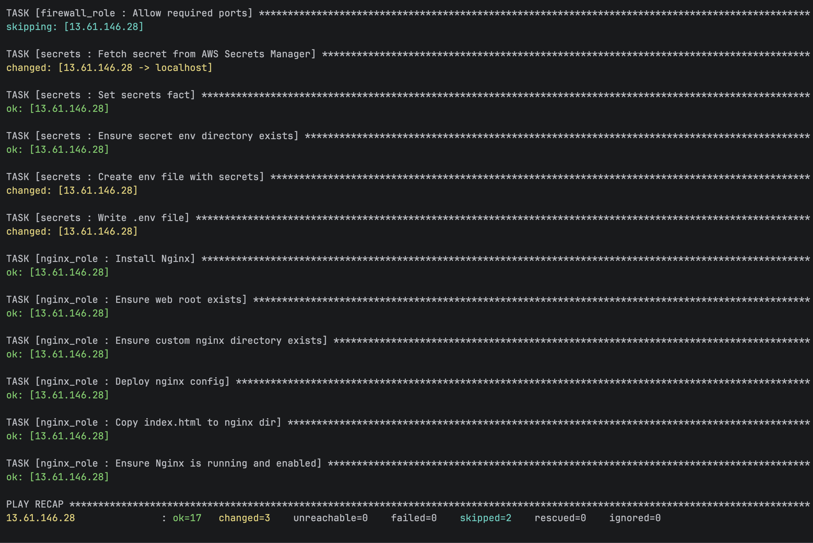

## Ansible
1. Create ansible baseline, firewall and nginx role
2. Create baseline tasks with defaults
3. Create firewall tasks with defaults
4. Create nginx tasks with defaults, handlers, files and templates
5. Create inventory file with group and host variables 
6. Verify ansible ssh ping 
6. Run baseline playbook 
7. Run firewall playbook , changed utf to firewalld for linux kernel 2023 
8. Run nginx playbook 
9. Verify nginx is running 
10. Run secret manager playbook 
11. Verify secrets are created 
12. Run web playbook

